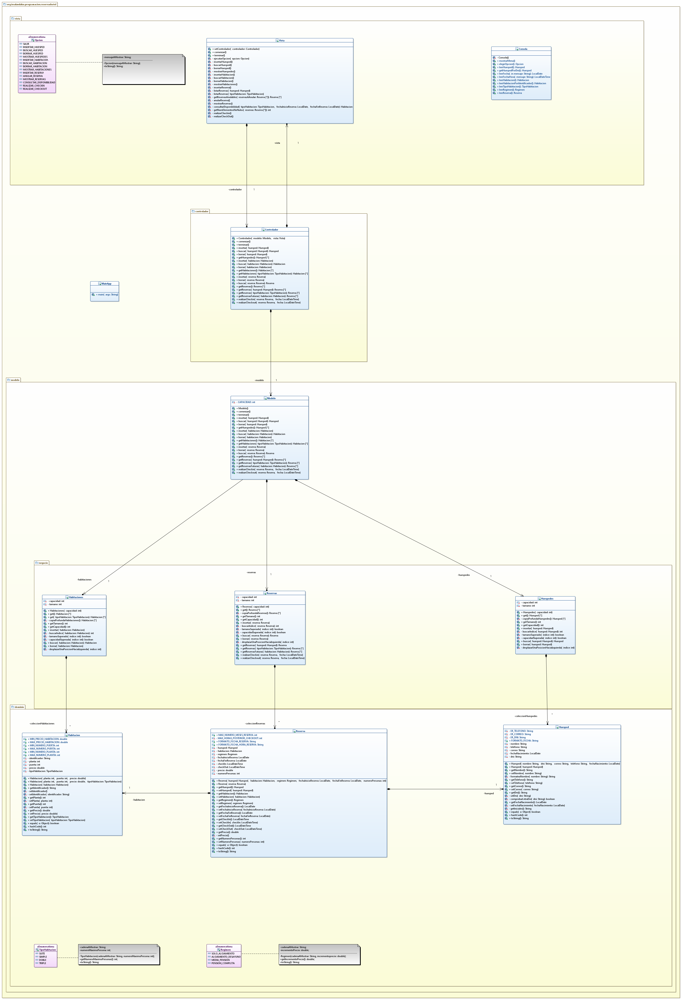

# Tarea: Reservas Hotel V1
## Profesor: Andrés Rubio del Río
## Alumno: Elisa López Abad

En este segundo spring de la tarea consistente en modelar la gestión de las **reservas del hotel IES Al-Ándalus**, se va a continuar usando la implementación basada en arrays para la gestión de las colecciones. Pero añadiremos el patrón MVC,
haciendo una primera aproximación al mismo que poco a poco iremos mejorando cuando se vayan adquiriendo los conocimientos necesarios. Por tal motivo, haremos una distinción entre la **vista**, encargada de interaccionar con el usuario, el **modelo**,
encargado de gestionar los datos y de interactuar con las colecciones y que dividiremos entre **clases de dominio y clases de negocio**. Por último, pero no menos importante, el **controlador** que será el encargado de dirigir toda esta orquesta.

Debes tener en cuenta el problema existente con las referencias, por lo que, al igual que en el primer spring, para cada clase que sea cliente de otra deberás devolver referencias a objetos nuevos en los métodos de acceso.
También crear nuevas referencias a nuevos objetos cuando los vayamos a asignar a atributos. Además, en los métodos de las clases dominio deberás devolver una copia profunda de los elementos de la colección en dicho método de acceso.

Por otro lado, dado el buen hacer en la primera entrega, el cliente ha decidido que se añada al menú de usuario la posibilidad de **realizar operacion de Checkin y Checkout**.

#### Primeros Pasos
1. Realiza un **fork** del repositorio de tu tarea anterior en otro nuevo llamado **ReservasHotel_v1**. Dicho repositorio lo clonarás localmente y realizarás las diferentes modificaciones que se piden en esta tarea.
2. Modifica el archivo `README.md`. Realiza tu **primer commit**.

#### Reservas
1. Agrega el método `realizarCheckin` para que se establezca la fecha de checkin de la reserva indicada como parámetro.
2. Agrega el método `realizarCheckout` para que se establezca la fecha de checkout de la reserva indicada como parámetro.
3. Realiza el **commit** correspondiente.

#### Opcion
1. Modifica el enumerado `Opcion` creado en el spring anterior para que se añadan las operaciones realizar checkin y realizar checkout, tal y como aparece en el diagrama de clases.
2. Realiza un **commit** con la modificación de este enumerado.

#### Consola
1. Modifica la clase `Consola` para que se incluya el método `leerFechaHora` que nos pedirá que introduzcamos una cadena correspondiente a una fecha y hora en el formato adecuado y devolverá el objeto `LocalDateTime` correspondiente. Esto se repetirá mientras la fecha introducida no sea válida.
2. Realiza el **commit** correspondiente.

#### Modelo
1. Crea la clase `Modelo` en el paquete indicado en el diagrama. Esta clase gestionará todo el modelo de nuestra aplicación. Será la encargada de comunicarse con las tres clases que hacen referencia a las colecciones de datos (huéspedes, habitaciones y reservas).
2. Crea el método `comenzar` que creará la instancia de las clases de negocio.
3. Crea el método `terminar` que simplemente mostrará un mensaje informativo indicando que el modelo ha terminado.
4. Crea los diferentes métodos `insertar` (para huesped, habitación y reserva).
5. Crea los diferentes métodos `buscar`, cada uno de los cuales devolverá una nueva instancia del elemento encontrado si éste existe.
6. Crea los diferentes métodos `borrar` (para huesped, habitación y reserva).
7. Crea los diferentes métodos `get`, que deben devolver una nueva lista conteniendo nuevas instancias no una copia de los elementos.
8. Crea los métodos `realizarCheckin` y `realizarCheckout`.
9. Realiza un **commit** con la nueva clase creada.

#### Controlador
1. Crea la clase `Controlador` en el paquete indicado en el diagrama. Esta clase será la encargada de hacer de intermediario entre la vista y el modelo.
2. Crea los atributos con la visibilidad adecuados.
3. Crea el constructor con parámetros que comprobará que no son nulos y los asignará a los atributos. Además, debe llamar al método `setControlador` de la vista con una instancia suya.
4. Crea los métodos `comenzar` y `terminar`, que llamarán a los correspondientes métodos en el modelo y en la vista.
5. Crea los demás métodos, los cuales simplemente harán una llamada al correspondiente método del modelo.
6. Realiza un **commit** con la nueva clase creada.

#### Vista
1. Crea la clase `Vista`, en el paquete adecuado.
2. Crea los diferentes atributos que se indican en el diagrama de clases con su visibilidad adecuada.
3. Excepto el método `main`, mueve todos los métodos existentes en la clase `MainApp` del spring anterior a la clase `Vista`.
4. Crea el método `setControlador` que asignará el controlador pasado al atributo si este no es nulo.
5. Crea el método `comenzar` que mostrará el menú, leerá una opción de consola y la ejecutará. Repetirá este proceso mientras la opción elegida no sea la correspondiente a salir. Utilizará los correspondientes métodos de la clase `Consola`.
6. Crea el método `terminar` que simplemente mostrará un mensaje de despedida por consola.
7. Modifica el método `ejecutarOpcion` para que permita realizar las operaciones realizar checkin y realizar checkout.
8. Crea el método `realizarCheckin`, que una vez localizada la reserva a la que realizar el checkin, deberá llamar al método correspondiente del controlador. Para localizar la reserva deberá preguntarse por el huesped de la misma, obtener su lista de reservas y establecer la fecha y hora de checkin de la reserva correspondiente. Hay que tener en cuenta que un huesped puede haber realizado varias reservas para el mismo día. Además, en caso de intentar hacer checkin de una reserva no existente en el día indicado para el huésped, la aplicación deberá informar con algún mensaje de lo sucedido.
9. Crea el método `realizarCheckout`, que una vez localizada la reserva a la que realizar el checkout, deberá llamar al método correspondiente del controlador. Para localizar la reserva deberá preguntarse por el huesped de la misma, obtener su lista de reservas y establecer la fecha y hora de checkout de la reserva correspondiente. Hay que tener en cuenta que un huesped puede haber realizado varias reservas para el mismo día. Además, en caso de intentar hacer checkout de una reserva no existente en el día indicado para el huésped, la aplicación deberá informar con algún mensaje de lo sucedido.
10. Realiza un **commit** con la nueva clase creada.

#### Main App
1. Modifica la clase `MainApp` para que tenga un único método `main` que será el método de entrada a nuestra aplicación. Este método simplemente creará una vista, un modelo y un controlador, pasándoles las instancias antes creadas. Luego simplemente invocará al método comenzar del controlador.
2. Realiza las pruebas que estimes oportunas y cuando consideres que todo es correcto, realiza el último **commit** y seguidamente realiza el **push** a tu repositorio remoto.

#### Se valorará:

- La indentación debe ser correcta en cada uno de los apartados.
- El nombre de las variables debe ser adecuado.
- Se debe utilizar la clase `Entrada` para realizar la entrada por teclado.
- El programa debe pasar todas las pruebas que van en el esqueleto del proyecto y toda entrada del programa será validada, para evitar que el programa termine abruptamente debido a una excepción. Además, que ni decir tiene, el programa no debe contener ningún error léxico, sintáctico, de dependencias, etc.
- La corrección ortográfica tanto en los comentarios como en los mensajes que se muestren al usuario.
